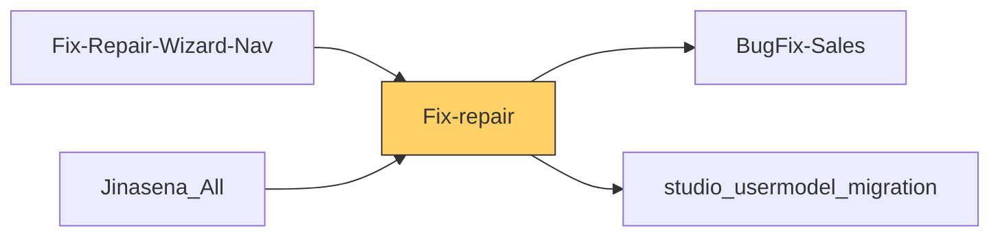

# Functional Documentation — Fix-repair

> Generated by `scripts/generate_functional_docs.py` from branch `Visual_Migration_02` (commit 435d81d 2026-10-06) and the installed module on the clean environment. For every attribute: **Function** = what it does, **Depends on** = the attributes it relies on (owning module in brackets when it is not this repo), **Used by** = the attributes in any Jinasena repo that rely on it.

| Item | Value |
|---|---|
| Technical name | `Fix-repair` |
| Title | Jinasena : Module : Repair |
| Version | `17.0.1.0.367` |
| Category | Helpdesk |
| License | LGPL-3 |
| Installed on environment | installed 17.0.1.0.367 |
| History | [CHANGELOG.md](CHANGELOG.md) |

## Purpose

<!-- SUMMARY:repo -->
Fix-repair is the main module for the Jinasena Customer Care repair workflow. Branch and factory staff use it with Odoo Helpdesk, Field Service, Sales and Inventory to handle a customer's item from intake to dispatch. Each repair is a helpdesk ticket that drives the item's stock movements, the FSM diagnosis task, the repair quotation, and invoicing and payment checks. RUG ("Reject Under Guarantee") covers warranty claims and customer-pays paths. The module also replaces the Studio customizations that once implemented this workflow with Python code it owns.

- Repair ticket lifecycle: sequence numbers, stage moves, cancel/reopen, audit fields, a ticket lock after the first validated movement, and the Assign to Me button.
- Item movements: Receipt, Send to Factory, Received at Factory, Plan Intervention, Mark as Done, Send to / Received at Sales Centre, Return and Dispatch. These use auto-created `<WH>/Intransit` and `<WH>/Repair` locations.
- Diagnosis: a Repair Diagnosis tab on the FSM task, backed by ten catalogue models (conditions, symptoms, diagnosis, reasons, resolutions, stages).
- Repair quotations: Repair quotation type, RUG request/approve/reject, Not Under Warranty flag, Re-estimate, stock-shortage warning and confirm gates.
- Invoicing and payments: a single full invoice for customer-pays repairs, RUG account reassignment with automatic settlement, advance-payment percentage checks, and payment gates on delivery Validate and Dispatch.
- Settings and master data: Factory Repair Location per company, Repair Accounts (RUG account per company), contact VAT/SVAT and bank-guarantee fields.
- Reports and letters: Studio-built repair reports and customer letter / final notice email templates.
<!-- /SUMMARY -->

## Module dependencies

| Kind | Modules |
|---|---|
| Odoo standard / enterprise | `base_setup`, `helpdesk`, `helpdesk_fsm`, `repair`, `sale`, `sale_stock`, `industry_fsm_sale`, `industry_fsm_stock`, `industry_fsm_report` |
| Jinasena repos | `BugFix-Sales`, `studio_usermodel_migration` |
| Third-party apps |  |
| Used by (Jinasena repos that depend on this one) | `Fix-Repair-Wizard-Nav`, `Jinasena_All` |

## Contents at a glance

| Attribute type | Count |
|---|---|
| Models created | 13 |
| Models extended | 24 |
| Fields | 662 |
| Python methods | 247 |
| Views | 107 |
| Window actions | 33 |
| Server actions | 52 |
| Automations | 23 |
| Approval rules | 1 |
| Menus | 27 |
| Mail templates | 10 |
| Access rights | 48 |
| Record rules | 33 |
| Install hooks | 13 |
| Migration scripts | 34 |

## Models

Each model has its own page (the full reference is too large for one GitHub page).

| Model | Description | Created / extends | Fields | Views | Actions + automations | Approvals |
|---|---|---|---|---|---|---|
| [`account.move`](functional_docs/account.move.md) | Journal Entry | extends (account) | 4 | 0 | 0 | 0 |
| [`account.move.line`](functional_docs/account.move.line.md) | Journal Item | extends (account) | 0 | 0 | 0 | 0 |
| [`account.payment`](functional_docs/account.payment.md) | account.payment | extends (account) | 2 | 0 | 0 | 0 |
| [`account.payment.register`](functional_docs/account.payment.register.md) | Register Payment | extends (account) | 0 | 0 | 0 | 0 |
| [`helpdesk.sla`](functional_docs/helpdesk.sla.md) | Helpdesk SLA Policies | extends (helpdesk) | 0 | 0 | 0 | 0 |
| [`helpdesk.stage`](functional_docs/helpdesk.stage.md) | Helpdesk Stage | extends (helpdesk) | 1 | 2 | 2 | 0 |
| [`helpdesk.team`](functional_docs/helpdesk.team.md) | Helpdesk Team | extends (helpdesk) | 0 | 2 | 0 | 0 |
| [`helpdesk.ticket`](functional_docs/helpdesk.ticket.md) | Helpdesk Ticket | extends (helpdesk) | 120 | 9 | 36 | 1 |
| [`helpdesk.ticket.report.analysis`](functional_docs/helpdesk.ticket.report.analysis.md) | Ticket Analysis | extends (helpdesk) | 0 | 0 | 0 | 0 |
| [`helpdesk.ticket.type`](functional_docs/helpdesk.ticket.type.md) | Helpdesk Ticket Type | extends (helpdesk) | 4 | 3 | 0 | 0 |
| [`ir.actions.report`](functional_docs/ir.actions.report.md) | Report Action | extends (base) | 0 | 0 | 0 | 0 |
| [`product.template`](functional_docs/product.template.md) | Product | extends (product) | 0 | 1 | 0 | 0 |
| [`project.task`](functional_docs/project.task.md) | Task | extends (project) | 27 | 3 | 1 | 0 |
| [`repair.order`](functional_docs/repair.order.md) | Repair Order | extends (repair) | 1 | 2 | 6 | 0 |
| [`res.config.settings`](functional_docs/res.config.settings.md) | Config Settings | extends (base) | 1 | 1 | 0 | 0 |
| [`res.partner`](functional_docs/res.partner.md) | Contact | extends (base) | 12 | 2 | 0 | 0 |
| [`res.users`](functional_docs/res.users.md) | User | extends (base) | 12 | 1 | 2 | 0 |
| [`sale.order`](functional_docs/sale.order.md) | Sales Order | extends (sale) | 13 | 1 | 0 | 0 |
| [`sale.order.line`](functional_docs/sale.order.line.md) | Sales Order Line | extends (sale) | 0 | 0 | 0 | 0 |
| [`stock.location`](functional_docs/stock.location.md) | Inventory Locations | extends (stock) | 10 | 0 | 0 | 0 |
| [`stock.lot`](functional_docs/stock.lot.md) | Lot/Serial | extends (stock) | 1 | 0 | 0 | 0 |
| [`stock.picking`](functional_docs/stock.picking.md) | Transfer | extends (stock) | 18 | 1 | 0 | 0 |
| [`stock.return.picking`](functional_docs/stock.return.picking.md) | Return Picking | extends (stock) | 5 | 0 | 0 | 0 |
| [`stock.warehouse`](functional_docs/stock.warehouse.md) | Warehouse | extends (stock) | 0 | 1 | 0 | 0 |
| [`x_conditions`](functional_docs/x_conditions.md) | Conditions | created | 35 | 8 | 3 | 0 |
| [`x_diagnosis_areas`](functional_docs/x_diagnosis_areas.md) | Diagnosis Areas | created | 35 | 8 | 3 | 0 |
| [`x_diagnosis_codes`](functional_docs/x_diagnosis_codes.md) | Diagnosis Codes | created | 36 | 8 | 3 | 0 |
| [`x_repair_accounts`](functional_docs/x_repair_accounts.md) | Repair Accounts | created | 35 | 5 | 2 | 0 |
| [`x_repair_master_data.migration`](functional_docs/x_repair_master_data.migration.md) | Repair Master Data — Studio→Python migration helper | created | 0 | 0 | 0 | 0 |
| [`x_repair_reason`](functional_docs/x_repair_reason.md) | Repair Reason | created | 35 | 4 | 2 | 0 |
| [`x_repair_reason_custom`](functional_docs/x_repair_reason_custom.md) | Repair Reason - Customer | created | 35 | 4 | 2 | 0 |
| [`x_repair_stages`](functional_docs/x_repair_stages.md) | Repair Stages | created | 35 | 4 | 2 | 0 |
| [`x_repair_sub_reason`](functional_docs/x_repair_sub_reason.md) | Repair Sub Reason | created | 35 | 4 | 2 | 0 |
| [`x_resolutions`](functional_docs/x_resolutions.md) | Resolutions | created | 35 | 8 | 3 | 0 |
| [`x_symptom_areas`](functional_docs/x_symptom_areas.md) | Symptom Areas | created | 35 | 8 | 3 | 0 |
| [`x_symptom_codes`](functional_docs/x_symptom_codes.md) | Symptom Codes | created | 36 | 8 | 3 | 0 |
| [`x_task_diagnosis`](functional_docs/x_task_diagnosis.md) | Task Diagnosis | created | 44 | 8 | 0 | 0 |

## Menus

**Menus (27):**

| Name | Record name | State | Function | Depends on | Used by |
|---|---|---|---|---|---|
| Helpdesk/Configuration/Repair Accounts | `menu_f6_repair_accounts` |  | Menu **Helpdesk/Configuration/Repair Accounts** — opens _Repair Accounts_. | `window action Fix-repair.act_window_2175_repair_accounts` |  |
| Helpdesk/Configuration/Repair Accounts | `menu_1054_repair_accounts` |  | Menu **Helpdesk/Configuration/Repair Accounts** — opens _Repair Accounts_. | `window action Fix-repair.act_window_2175_repair_accounts` |  |
| Helpdesk/Repair Diagnosis | `menu_repair_diagnosis_root` |  | Menu **Helpdesk/Repair Diagnosis** — folder that groups the menus under it. |  |  |
| Helpdesk/Repair Diagnosis/Conditions | `menu_repair_diagnosis_conditions` |  | Menu **Helpdesk/Repair Diagnosis/Conditions** — opens _Conditions_. | `window action Fix-repair.action_x_conditions` |  |
| Helpdesk/Repair Diagnosis/Conditions | `menu_f6_conditions` |  | Menu **Helpdesk/Repair Diagnosis/Conditions** — opens _Conditions_. | `window action Fix-repair.act_window_2209_conditions` |  |
| Helpdesk/Repair Diagnosis/Diagnosis Areas | `menu_repair_diagnosis_diagnosis_areas` |  | Menu **Helpdesk/Repair Diagnosis/Diagnosis Areas** — opens _Diagnosis Areas_. | `window action Fix-repair.action_x_diagnosis_areas` |  |
| Helpdesk/Repair Diagnosis/Diagnosis Areas | `menu_f6_diagnosis_areas` |  | Menu **Helpdesk/Repair Diagnosis/Diagnosis Areas** — opens _Diagnosis Areas_. | `window action Fix-repair.act_window_2212_diagnosis_areas` |  |
| Helpdesk/Repair Diagnosis/Diagnosis Codes | `menu_repair_diagnosis_diagnosis_codes` |  | Menu **Helpdesk/Repair Diagnosis/Diagnosis Codes** — opens _Diagnosis Codes_. | `window action Fix-repair.action_x_diagnosis_codes` |  |
| Helpdesk/Repair Diagnosis/Diagnosis Codes | `menu_f6_diagnosis_codes` |  | Menu **Helpdesk/Repair Diagnosis/Diagnosis Codes** — opens _Diagnosis Codes_. | `window action Fix-repair.action_x_diagnosis_codes` |  |
| Helpdesk/Repair Diagnosis/Repair Reason | `menu_repair_diagnosis_repair_reason` |  | Menu **Helpdesk/Repair Diagnosis/Repair Reason** — opens _Repair Reason_. | `window action Fix-repair.action_x_repair_reason` |  |
| Helpdesk/Repair Diagnosis/Repair Reason | `menu_f6_repair_reason` |  | Menu **Helpdesk/Repair Diagnosis/Repair Reason** — opens _Repair Reason_. | `window action Fix-repair.action_x_repair_reason` |  |
| Helpdesk/Repair Diagnosis/Repair Reason - Customer | `menu_repair_diagnosis_repair_reason_custom` |  | Menu **Helpdesk/Repair Diagnosis/Repair Reason - Customer** — opens _Repair Reason - Customer_. | `window action Fix-repair.action_x_repair_reason_custom` |  |
| Helpdesk/Repair Diagnosis/Repair Reason - Customer | `menu_f6_repair_reason_customer` |  | Menu **Helpdesk/Repair Diagnosis/Repair Reason - Customer** — opens _Repair Reason - Customer_. | `window action Fix-repair.act_window_2218_repair_reason_customer` |  |
| Helpdesk/Repair Diagnosis/Repair Stages | `menu_repair_diagnosis_repair_stages` |  | Menu **Helpdesk/Repair Diagnosis/Repair Stages** — opens _Repair Stages_. | `window action Fix-repair.action_x_repair_stages` |  |
| Helpdesk/Repair Diagnosis/Repair Stages | `menu_f6_repair_stages` |  | Menu **Helpdesk/Repair Diagnosis/Repair Stages** — opens _Repair Stages_. | `window action Fix-repair.action_x_repair_stages` |  |
| Helpdesk/Repair Diagnosis/Repair Sub Reason | `menu_repair_diagnosis_repair_sub_reason` |  | Menu **Helpdesk/Repair Diagnosis/Repair Sub Reason** — opens _Repair Sub Reason_. | `window action Fix-repair.action_x_repair_sub_reason` |  |
| Helpdesk/Repair Diagnosis/Repair Sub Reason | `menu_f6_repair_sub_reason` |  | Menu **Helpdesk/Repair Diagnosis/Repair Sub Reason** — opens _Repair Sub Reason_. | `window action Fix-repair.act_window_2214_repair_sub_reason` |  |
| Helpdesk/Repair Diagnosis/Resolutions | `menu_repair_diagnosis_resolutions` |  | Menu **Helpdesk/Repair Diagnosis/Resolutions** — opens _Resolutions_. | `window action Fix-repair.action_x_resolutions` |  |
| Helpdesk/Repair Diagnosis/Resolutions | `menu_f6_resolutions` |  | Menu **Helpdesk/Repair Diagnosis/Resolutions** — opens _Resolutions_. | `window action Fix-repair.act_window_2215_resolutions` |  |
| Helpdesk/Repair Diagnosis/Symptom Areas | `menu_repair_diagnosis_symptom_areas` |  | Menu **Helpdesk/Repair Diagnosis/Symptom Areas** — opens _Symptom Areas_. | `window action Fix-repair.action_x_symptom_areas` |  |
| Helpdesk/Repair Diagnosis/Symptom Areas | `menu_f6_symptom_areas` |  | Menu **Helpdesk/Repair Diagnosis/Symptom Areas** — opens _Symptom Areas_. | `window action Fix-repair.act_window_2210_symptom_areas` |  |
| Helpdesk/Repair Diagnosis/Symptom Codes | `menu_repair_diagnosis_symptom_codes` |  | Menu **Helpdesk/Repair Diagnosis/Symptom Codes** — opens _Symptom Codes_. | `window action Fix-repair.action_x_symptom_codes` |  |
| Helpdesk/Repair Diagnosis/Symptom Codes | `menu_f6_symptom_codes` |  | Menu **Helpdesk/Repair Diagnosis/Symptom Codes** — opens _Symptom Codes_. | `window action Fix-repair.act_window_2211_symptom_codes` |  |
| Helpdesk/Reporting/Repair Job Details | `menu_f6_repair_job_details` |  | Menu **Helpdesk/Reporting/Repair Job Details** — opens _Repair Job Details_. | `window action Fix-repair.act_window_2312_repair_job_details` |  |
| Helpdesk/Reporting/Repair Job Details for the Period - RUG Only | `menu_f6_repair_job_details_for_the_period_rug_only` |  | Menu **Helpdesk/Reporting/Repair Job Details for the Period - RUG Only** — opens _Repair Job Details for the Period - RUG Only_. | `window action Fix-repair.act_window_2234_repair_job_details_for_the_period_rug_only` |  |
| Inventory/Inventory Setup/Warehouse | `menu_f6_warehouse_1` | hidden | Menu **Inventory/Inventory Setup/Warehouse** — opens _Warehouse_. | `window action BugFix-Stock.action_2469_warehouse` (BugFix-Stock) |  |
| Inventory/wAREHOUSE/WareHouse | `menu_f6_warehouse` |  | Menu **Inventory/wAREHOUSE/WareHouse** — opens _WareHouse_. | `window action BugFix-Stock.action_2468_warehouse` (BugFix-Stock) |  |

## Templates and website pages

**Templates (1):**

| Name | Record name | Type | What it changes | Function | Depends on | Used by |
|---|---|---|---|---|---|---|
| fix_repair_document_intro_conclusion | `fix_repair_document_intro_conclusion` | qweb | after `//div[@id='informations']`: add div; inside `//div[hasclass('page')]`: add div | Sale order PDF report: prints the order's Introduction text after the address block and its Conclusion text at the end of the page, when filled. | `view sale.report_saleorder_document` (sale) |  |

## Data records loaded (111)

Records this module creates on install (lookup values, sequences, defaults, companies, users …).

| Type | Record name | Function | Depends on | Used by |
|---|---|---|---|---|
| `helpdesk.stage` | `stage_sent_to_factory` | _(belongs to a company the documentation login cannot open)_ |  |  |
| `helpdesk.stage` | `stage_received_at_factory` | _(belongs to a company the documentation login cannot open)_ |  |  |
| `helpdesk.stage` | `stage_diagnosis` | _(belongs to a company the documentation login cannot open)_ |  |  |
| `helpdesk.stage` | `stage_estimation_sent_to_customer` | _(belongs to a company the documentation login cannot open)_ |  |  |
| `helpdesk.stage` | `stage_estimation_approval_received` | _(belongs to a company the documentation login cannot open)_ |  |  |
| `helpdesk.stage` | `stage_advance_received` | _(belongs to a company the documentation login cannot open)_ |  |  |
| `helpdesk.stage` | `stage_repair_started` | _(belongs to a company the documentation login cannot open)_ |  |  |
| `helpdesk.stage` | `stage_repair_completed` | _(belongs to a company the documentation login cannot open)_ |  |  |
| `helpdesk.stage` | `stage_sent_to_sales_centre` | _(belongs to a company the documentation login cannot open)_ |  |  |
| `helpdesk.stage` | `stage_received_at_sales_centre` | _(belongs to a company the documentation login cannot open)_ |  |  |
| `helpdesk.stage` | `stage_handed_over_to_customer` | _(belongs to a company the documentation login cannot open)_ |  |  |
| `helpdesk.stage` | `stage_cancelled` | _(belongs to a company the documentation login cannot open)_ |  |  |
| `helpdesk.ticket.type` | `ticket_type_rug` | Seed record **Repair - Under Warranty - RUG** loaded on install. |  |  |
| `helpdesk.ticket.type` | `ticket_type_external_not_rug` | Seed record **Repair - Under Warranty -  External not RUG** loaded on install. |  |  |
| `helpdesk.ticket.type` | `ticket_type_not_under_warranty_with_serial` | Seed record **Repair - Not Under Warranty (With Serial No)** loaded on install. |  |  |
| `helpdesk.ticket.type` | `ticket_type_not_under_warranty_without_serial` | Seed record **Repair - Not Under Warranty (Without Serial No)** loaded on install. |  |  |
| `ir.default` | `default_298_helpdesk_ticket_x_studio_pick_id` | Sets the default of **Pick Id (Helpdesk Ticket)** to `"0"`. | `helpdesk.ticket.x_studio_pick_id` |  |
| `ir.default` | `default_299_x_repair_reason_x_active` | Sets the default of **Active (Repair Reason)** to `true`. | `x_repair_reason.x_active` |  |
| `ir.default` | `default_300_x_repair_reason_x_studio_sequence` | Sets the default of **Sequence (Repair Reason)** to `10`. | `x_repair_reason.x_studio_sequence` |  |
| `ir.default` | `default_301_helpdesk_ticket_name` | Sets the default of **Subject (Helpdesk Ticket)** to `"New"`. | `helpdesk.ticket.name` (helpdesk) |  |
| `ir.default` | `default_328_x_repair_accounts_x_active` | Sets the default of **Active (Repair Accounts)** to `true`. | `x_repair_accounts.x_active` |  |
| `ir.default` | `default_329_x_repair_accounts_x_studio_sequence` | Sets the default of **Sequence (Repair Accounts)** to `10`. | `x_repair_accounts.x_studio_sequence` |  |
| `ir.default` | `default_332_x_conditions_x_active` | Sets the default of **Active (Conditions)** to `true`. | `x_conditions.x_active` |  |
| `ir.default` | `default_333_x_conditions_x_studio_sequence` | Sets the default of **Sequence (Conditions)** to `10`. | `x_conditions.x_studio_sequence` |  |
| `ir.default` | `default_334_x_symptom_areas_x_active` | Sets the default of **Active (Symptom Areas)** to `true`. | `x_symptom_areas.x_active` |  |
| `ir.default` | `default_335_x_symptom_areas_x_studio_sequence` | Sets the default of **Sequence (Symptom Areas)** to `10`. | `x_symptom_areas.x_studio_sequence` |  |
| `ir.default` | `default_336_x_symptom_codes_x_active` | Sets the default of **Active (Symptom Codes)** to `true`. | `x_symptom_codes.x_active` |  |
| `ir.default` | `default_337_x_symptom_codes_x_studio_sequence` | Sets the default of **Sequence (Symptom Codes)** to `10`. | `x_symptom_codes.x_studio_sequence` |  |
| `ir.default` | `default_338_x_diagnosis_areas_x_active` | Sets the default of **Active (Diagnosis Areas)** to `true`. | `x_diagnosis_areas.x_active` |  |
| `ir.default` | `default_339_x_diagnosis_areas_x_studio_sequence` | Sets the default of **Sequence (Diagnosis Areas)** to `10`. | `x_diagnosis_areas.x_studio_sequence` |  |
| `ir.default` | `default_340_x_diagnosis_codes_x_active` | Sets the default of **Active (Diagnosis Codes)** to `true`. | `x_diagnosis_codes.x_active` |  |
| `ir.default` | `default_341_x_diagnosis_codes_x_studio_sequence` | Sets the default of **Sequence (Diagnosis Codes)** to `10`. | `x_diagnosis_codes.x_studio_sequence` |  |
| `ir.default` | `default_343_x_repair_sub_reason_x_active` | Sets the default of **Active (Repair Sub Reason)** to `true`. | `x_repair_sub_reason.x_active` |  |
| `ir.default` | `default_344_x_repair_sub_reason_x_studio_sequence` | Sets the default of **Sequence (Repair Sub Reason)** to `10`. | `x_repair_sub_reason.x_studio_sequence` |  |
| `ir.default` | `default_349_x_resolutions_x_active` | Sets the default of **Active (Resolutions)** to `true`. | `x_resolutions.x_active` |  |
| `ir.default` | `default_350_x_resolutions_x_studio_sequence` | Sets the default of **Sequence (Resolutions)** to `10`. | `x_resolutions.x_studio_sequence` |  |
| `ir.default` | `default_353_x_repair_stages_x_active` | Sets the default of **Active (Repair Stages)** to `true`. | `x_repair_stages.x_active` |  |
| `ir.default` | `default_354_x_repair_stages_x_studio_sequence` | Sets the default of **Sequence (Repair Stages)** to `10`. | `x_repair_stages.x_studio_sequence` |  |
| `ir.default` | `default_355_x_task_diagnosis_x_active` | Sets the default of **Active (Task Diagnosis)** to `true`. | `x_task_diagnosis.x_active` |  |
| `ir.default` | `default_356_x_task_diagnosis_x_studio_sequence` | Sets the default of **Sequence (Task Diagnosis)** to `10`. | `x_task_diagnosis.x_studio_sequence` |  |
| `ir.default` | `default_357_x_repair_reason_custom_x_active` | Sets the default of **Active (Repair Reason - Customer)** to `true`. | `x_repair_reason_custom.x_active` |  |
| `ir.default` | `default_358_x_repair_reason_custom_x_studio_sequence` | Sets the default of **Sequence (Repair Reason - Customer)** to `10`. | `x_repair_reason_custom.x_studio_sequence` |  |
| `ir.default` | `default_369_helpdesk_ticket_x_studio_re_estimate_count` | Sets the default of **Re-estimate Count (Helpdesk Ticket)** to `"0"`. | `helpdesk.ticket.x_studio_re_estimate_count` |  |
| `ir.default` | `default_360_helpdesk_ticket_x_studio_cancel_status` | Sets the default of **Cancel Status (Helpdesk Ticket)** to `"None"`. | `helpdesk.ticket.x_studio_cancel_status` |  |
| `ir.default` | `default_361_helpdesk_ticket_x_studio_reopen_status` | Sets the default of **Reopen Status (Helpdesk Ticket)** to `"None"`. | `helpdesk.ticket.x_studio_reopen_status` |  |
| `ir.default` | `default_368_helpdesk_ticket_x_studio_re_estimate_status` | Sets the default of **Re-estimate Status (Helpdesk Ticket)** to `"None"`. | `helpdesk.ticket.x_studio_re_estimate_status` |  |
| `ir.default` | `default_372_helpdesk_ticket_x_studio_quick_repair_status` | Sets the default of **Tested OK (Helpdesk Ticket)** to `"None"`. | `helpdesk.ticket.x_studio_quick_repair_status` |  |
| `ir.sequence` | `seq_repair_ticket` | Numbering sequence `repair.seq` — prefix `REPAIR/%(year)s/`, 5 digits. |  |  |
| `ir.sequence` | `seq_repair_serial` | Numbering sequence `repair.serial.seq` — prefix `REP-SERIAL/%(year)s/`, 5 digits. |  |  |
| `x_conditions` | `x_conditions_1` | Seed record **When working for too long** loaded on install. |  |  |
| `x_conditions` | `x_conditions_2` | Seed record **When switched on** loaded on install. |  |  |
| `x_conditions` | `x_conditions_3` | Seed record **Voltage spikes** loaded on install. |  |  |
| `x_conditions` | `x_conditions_4` | Seed record **When working for too long** loaded on install. |  |  |
| `x_diagnosis_areas` | `x_diagnosis_areas_1` | Seed record **Burnt part** loaded on install. |  |  |
| `x_diagnosis_areas` | `x_diagnosis_areas_2` | Seed record **Part coroded** loaded on install. |  |  |
| `x_diagnosis_areas` | `x_diagnosis_areas_6` | Seed record **Part need replacement** loaded on install. |  |  |
| `x_diagnosis_areas` | `x_diagnosis_areas_7` | Seed record **Part damaged** loaded on install. |  |  |
| `x_diagnosis_areas` | `x_diagnosis_areas_8` | Seed record **Part worn out** loaded on install. |  |  |
| `x_diagnosis_areas` | `x_diagnosis_areas_9` | Seed record **Motor burnt** loaded on install. |  |  |
| `x_diagnosis_areas` | `x_diagnosis_areas_10` | Seed record **Burnt Part** loaded on install. |  |  |
| `x_diagnosis_areas` | `x_diagnosis_areas_12` | Seed record **Coroded** loaded on install. |  |  |
| `x_diagnosis_areas` | `x_diagnosis_areas_13` | Seed record **Damgd** loaded on install. |  |  |
| `x_diagnosis_areas` | `x_diagnosis_areas_14` | Seed record **Defctv** loaded on install. |  |  |
| `x_diagnosis_codes` | `x_diagnosis_codes_1` | Seed record **Seal damaged** loaded on install. |  |  |
| `x_diagnosis_codes` | `x_diagnosis_codes_2` | Seed record **Shaft** loaded on install. |  |  |
| `x_diagnosis_codes` | `x_diagnosis_codes_3` | Seed record **Preasure booster tank** loaded on install. |  |  |
| `x_diagnosis_codes` | `x_diagnosis_codes_7` | Seed record **Circuit** loaded on install. |  |  |
| `x_diagnosis_codes` | `x_diagnosis_codes_8` | Seed record **Motor winding burnt** loaded on install. |  |  |
| `x_diagnosis_codes` | `x_diagnosis_codes_9` | Seed record **Condenser burnt** loaded on install. |  |  |
| `x_diagnosis_codes` | `x_diagnosis_codes_10` | Seed record **Diodes** loaded on install. |  |  |
| `x_diagnosis_codes` | `x_diagnosis_codes_11` | Seed record **Fuse burnt** loaded on install. |  |  |
| `x_diagnosis_codes` | `x_diagnosis_codes_12` | Seed record **Base plate** loaded on install. |  |  |
| `x_diagnosis_codes` | `x_diagnosis_codes_13` | Seed record **Motor housing** loaded on install. |  |  |
| `x_diagnosis_codes` | `x_diagnosis_codes_14` | Seed record **Pump body** loaded on install. |  |  |
| `x_diagnosis_codes` | `x_diagnosis_codes_15` | Seed record **Base plate** loaded on install. |  |  |
| `x_diagnosis_codes` | `x_diagnosis_codes_58` | Seed record **BRNT-COIL** loaded on install. |  |  |
| `x_diagnosis_codes` | `x_diagnosis_codes_59` | Seed record **BRNT-COND** loaded on install. |  |  |
| `x_repair_reason` | `x_repair_reason_1` | _(belongs to a company the documentation login cannot open)_ |  |  |
| `x_repair_reason` | `x_repair_reason_2` | _(belongs to a company the documentation login cannot open)_ |  |  |
| `x_repair_reason` | `x_repair_reason_6` | _(belongs to a company the documentation login cannot open)_ |  |  |
| `x_repair_reason` | `x_repair_reason_7` | _(belongs to a company the documentation login cannot open)_ |  |  |
| `x_repair_reason_custom` | `x_repair_reason_custom_4` | _(belongs to a company the documentation login cannot open)_ |  |  |
| `x_repair_reason_custom` | `x_repair_reason_custom_5` | _(belongs to a company the documentation login cannot open)_ |  |  |
| `x_repair_reason_custom` | `x_repair_reason_custom_6` | _(belongs to a company the documentation login cannot open)_ |  |  |
| `x_repair_reason_custom` | `x_repair_reason_custom_7` | _(belongs to a company the documentation login cannot open)_ |  |  |
| `x_repair_reason_custom` | `x_repair_reason_custom_8` | _(belongs to a company the documentation login cannot open)_ |  |  |
| `x_repair_reason_custom` | `x_repair_reason_custom_9` | _(belongs to a company the documentation login cannot open)_ |  |  |
| `x_repair_reason_custom` | `x_repair_reason_custom_10` | _(belongs to a company the documentation login cannot open)_ |  |  |
| `x_repair_reason_custom` | `x_repair_reason_custom_11` | _(belongs to a company the documentation login cannot open)_ |  |  |
| `x_repair_reason_custom` | `x_repair_reason_custom_12` | _(belongs to a company the documentation login cannot open)_ |  |  |
| `x_repair_reason_custom` | `x_repair_reason_custom_13` | _(belongs to a company the documentation login cannot open)_ |  |  |
| `x_repair_reason_custom` | `x_repair_reason_custom_15` | _(belongs to a company the documentation login cannot open)_ |  |  |
| `x_repair_reason_custom` | `x_repair_reason_custom_16` | _(belongs to a company the documentation login cannot open)_ |  |  |
| `x_repair_stages` | `x_repair_stages_1` | _(belongs to a company the documentation login cannot open)_ |  |  |
| `x_repair_stages` | `x_repair_stages_2` | _(belongs to a company the documentation login cannot open)_ |  |  |
| `x_repair_stages` | `x_repair_stages_3` | _(belongs to a company the documentation login cannot open)_ |  |  |
| `x_repair_stages` | `x_repair_stages_4` | _(belongs to a company the documentation login cannot open)_ |  |  |
| `x_repair_stages` | `x_repair_stages_5` | _(belongs to a company the documentation login cannot open)_ |  |  |
| `x_repair_stages` | `x_repair_stages_6` | _(belongs to a company the documentation login cannot open)_ |  |  |
| `x_repair_stages` | `x_repair_stages_7` | _(belongs to a company the documentation login cannot open)_ |  |  |
| `x_repair_sub_reason` | `x_repair_sub_reason_1` | _(belongs to a company the documentation login cannot open)_ |  |  |
| `x_repair_sub_reason` | `x_repair_sub_reason_2` | _(belongs to a company the documentation login cannot open)_ |  |  |
| `x_repair_sub_reason` | `x_repair_sub_reason_37` | _(belongs to a company the documentation login cannot open)_ |  |  |
| `x_repair_sub_reason` | `x_repair_sub_reason_38` | _(belongs to a company the documentation login cannot open)_ |  |  |
| `x_resolutions` | `x_resolutions_1` | Seed record **REJECT** loaded on install. |  |  |
| `x_resolutions` | `x_resolutions_2` | Seed record **REP** loaded on install. |  |  |
| `x_resolutions` | `x_resolutions_3` | Seed record **Reject** loaded on install. |  |  |
| `x_resolutions` | `x_resolutions_4` | Seed record **REP** loaded on install. |  |  |
| `x_symptom_areas` | `x_symptom_areas_1` | Seed record **Faulty** loaded on install. |  |  |
| `x_symptom_areas` | `x_symptom_areas_3` | Seed record **Faulty** loaded on install. |  |  |
| `x_symptom_codes` | `x_symptom_codes_1` | Seed record **Symptom 01** loaded on install. |  |  |

## Install hooks (`hooks.py`)

Wired in the manifest: post_init_hook → `post_init_hook`.

| Function | Hook | What it does (docstring) | Lines |
|---|---|---|---|
| `strip_studio_xmlids_for_ported_fields` |  | Delete studio_customization ir.model.data rows for the 12 ported fields. | 30 |
| `load_post_init_view_files` |  | Load view inherits whose xpaths reference elements that only exist AFTER the full inherit chain has been applied to the parent view. Loading these at manifest-'data' time triggers Odoo's init-time xml validation, which composes the parent view arch WITHOUT sibling inherits and rejects xpaths pointin | 47 |
| `attach_repair_stages_to_all_teams` |  | Attach the 12 seeded repair-pipeline stages to every existing helpdesk.team record. | 47 |
| `enable_product_returns_on_all_teams` |  | v252: force `use_product_returns=True` on every helpdesk.team. | 27 |
| `seed_default_stock_location_users` |  | v251: link the built-in admin user (base.user_admin) to the default WH stock locations so the "Return Receipt Location" dropdown on helpdesk.ticket has non-empty options out of the box. | 55 |
| `seed_admin_repair_location_defaults` |  | v253: seed the two per-user repair location fields on every internal user that has them unset. | 60 |
| `seed_repair_return_receipt_locations` |  | v254: flag every warehouse's main stock location (`stock.warehouse.lot_stock_id`) as `x_studio_repair_return_location=True`. | 37 |
| `enable_project_extras` |  | v265: match Clear-DB's project-feature parity on standalone. | 54 |
| `activate_internal_picking_types` |  | v272: flip active=True on every stock.picking.type with code='internal' whose warehouse_id is set. | 35 |
| `seed_repair_sequences_per_company` |  | v296: mint a per-company copy of repair.seq and repair.serial.seq for every existing res.company so ir.sequence.next_by_code resolves under the caller's active-company context. | 52 |
| `assign_names_to_stale_new_tickets` |  | v296: rename every helpdesk.ticket whose name is still 'New' (or empty) to a proper REPAIR/YYYY/NNNNN sequence value, scoped to each ticket's own company. | 44 |
| `_seed_field_selections` |  | Add missing ir.model.fields.selection rows via Odoo's _update_selection helper. Groups by (model, field), reads current selection, appends missing CDB values, calls _update_selection with the merged list — Odoo inserts only the new rows and keeps existing. | 43 |
| `post_init_hook` | post_init_hook | Odoo 17 post-install hook signature: (env). | 17 |

## Migration scripts (34)

Run once when the module is upgraded past that version.

| Version | Script | What it does |
|---|---|---|
| `17.0.1.0.225` | `post-migration.py` | One-shot upgrade cleanup for v225. |
| `17.0.1.0.236` | `post-migration.py` | One-shot upgrade cleanup for v236. |
| `17.0.1.0.237` | `post-migration.py` | One-shot upgrade cleanup for v237. |
| `17.0.1.0.238` | `post-migration.py` | Upgrade path for v238 — re-runs load_post_init_view_files with the new sentinel guard so previously-failed loads get a clean skip on DBs where Studio's hardcoded action IDs don't exist. |
| `17.0.1.0.239` | `post-migration.py` | Upgrade path for v239 — v238's sentinel was too loose (browse(195).exists() returned True on stand-alone because some unrelated action happened to have id=195). v239 fixes the sentinel to check the actual composed arch. Re-runs the loader with the corrected guard. |
| `17.0.1.0.240` | `post-migration.py` | Upgrade path for v240 — v239's sentinel had a jsonb cast bug. Re-runs the loader now that hooks.py is fixed. |
| `17.0.1.0.241` | `post-migration.py` | v241 post-migration — extends the shared master-data migration helper to cover the 6 new catalogue models added in Chunk 1a (x_conditions, x_diagnosis_areas, x_diagnosis_codes, x_symptom_areas, x_symptom_codes, x_resolutions). Flips their ir.model rows and ir.model.fields rows from state='manual' -> |
| `17.0.1.0.242` | `post-migration.py` | v242 post-migration — re-runs the post-init view loader with the sanitised ported.xml (view #4013 removed, //button[@name='195'] xpath stripped from #4012). Existing DBs get the sanitised arch applied via convert_file(mode='init'), which updates records in place by external ID. |
| `17.0.1.0.243` | `post-migration.py` | v243 post-migration — attach the 12 newly-seeded repair-pipeline helpdesk.stage records to every existing helpdesk.team so they show up on ticket statusbars. The stages themselves are created by data/repair_stages.xml during the normal upgrade load; this script just finishes the team wiring for exis |
| `17.0.1.0.244` | `post-migration.py` | v244 post-migration — no-op on upgrade path. |
| `17.0.1.0.250` | `pre-migration.py` | v250 pre-migration — force-create ir.model.data pins for the 11 Studio-created models Fix-repair owns. |
| `17.0.1.0.251` | `post-migration.py` | v251 upgrade migration — seed admin user into default WH stock locations for the Return Receipt Location dropdown. |
| `17.0.1.0.252` | `post-migration.py` | v252 upgrade migration — force use_product_returns=True on every helpdesk.team so the Return button surfaces on repair tickets. |
| `17.0.1.0.253` | `post-migration.py` | v253 upgrade migration — seed the two per-user repair location fields on every internal user that has them unset. |
| `17.0.1.0.254` | `post-migration.py` | v254 upgrade migration — flag each warehouse's Stock location as x_studio_repair_return_location=True so the RR - Auto Create Repair Route delegate can resolve its stock.picking.type search. |
| `17.0.1.0.265` | `post-migration.py` | v265 upgrade migration — enable project extras (Task Dependencies, Recurring Tasks, Ratings) so the 3 native buttons on project.task form become visible on standalone, matching Clear-DB. |
| `17.0.1.0.272` | `post-migration.py` | v272 upgrade migration — activate any dormant internal stock.picking.type records so the repair-flow _create_repair_transfer helper stops silently no-op'ing (only the initial Return was producing a picking; Send-to-Factory / Received-at-Factory / Send-to-Sales-Centre / Received-at-Sales-Centre were |
| `17.0.1.0.276` | `post-migration.py` | v276 upgrade — close the last repair-scope Studio field gaps. |
| `17.0.1.0.277` | `post-migration.py` | v277 upgrade — port Studio automation 176 'RR - Auto Generate Quotation Type for Repair SOs' as sale.order create/write override. |
| `17.0.1.0.278` | `post-migration.py` | v278 upgrade — bug fix on v277's _fix_repair_auto_generate_quotation_type. |
| `17.0.1.0.279` | `post-migration.py` | v279 upgrade — port Studio automation 193 'RR - Sales Price For RUG Items' as a sale.order.line create/write override on Fix-repair. |
| `17.0.1.0.280` | `post-migration.py` | v280 upgrade — port Studio automation 215 'RR - Validate RUG in Customer Invoice' + declare x_studio_rug_confirmed and x_studio_rug_acc_updated on account.move. |
| `17.0.1.0.281` | `post-migration.py` | v281 upgrade — bug fix on v280 install failure. |
| `17.0.1.0.282` | `post-migration.py` | v282 upgrade -- port Studio automation 174 'RR - Auto Select Product for RUG Repairs-3' as a stock.return.picking create/write override on Fix-repair. |
| `17.0.1.0.283` | `post-migration.py` | v283 upgrade -- port Studio automations 202 + 203 + 204 (RR - Track Lock Status trio) as create/write overrides on sale.order and an onchange handler on sale.order.line. |
| `17.0.1.0.284` | `post-migration.py` | v284 upgrade -- port Studio automation 241 / server action 2427 (RR - Validate Payment %) as an onchange handler on account.payment. |
| `17.0.1.0.285` | `post-migration.py` | v285 upgrade -- Odoo-17 fix for the Track Lock Status port from v283. |
| `17.0.1.0.286` | `post-migration.py` | v286 upgrade -- Odoo-17 gap in RUG-invoice validation port. |
| `17.0.1.0.287` | `post-migration.py` | v287 upgrade -- fix account.move.x_studio_rug_confirmed compute reactivity to sale.order side flips. |
| `17.0.1.0.288` | `post-migration.py` | v288 upgrade -- narrow v286's RUG-invoice settle guard so background writes (v287's SO -> invoice compute propagation) don't trip it. |
| `17.0.1.0.296` | `post-migration.py` | v296 post-migration — per-company repair sequence seed + backfill. |
| `17.0.1.0.325` | `post-migrate.py` | Phase F1: seed ir.model.fields.selection records for state=base fields via SQL. Odoo 17: `name` column is JSONB (translation) - must be JSON-encoded, not plain str. |
| `17.0.1.0.363` | `post-migrate.py` | Fix-repair v17.0.1.0.363: seed ir.model.fields.selection rows via Odoo's own _update_selection helper (framework API, not cr.execute). |
| `17.0.1.0.366` | `post-migrate.py` | v17.0.1.0.366: the 7 sale.order Studio check fields are now real computed fields (models/studio_computes.py). Their columns already exist, so Odoo does not fill them by itself: recompute every sales order once. ORM only. |

## Depends on other modules' attributes

Everything of other modules that this repo's attributes rely on. If one of these is removed or changed, this repo is affected.

| Module | Kind | Count | Attributes |
|---|---|---|---|
| `BugFix-Accounting` | Jinasena repo | 2 | account.move.line.x_studio_credit_limit_2, account.move.x_studio_sale_id |
| `BugFix-Analytics` | Jinasena repo | 1 | sale.order.line._bugfix_analytics_build_distribution() |
| `BugFix-Project` | Jinasena repo | 14 | project.task.x_studio_cancelled, project.task.x_studio_created_date, project.task.x_studio_end_quick_repair, project.task.x_studio_material_availability, project.task.x_studio_priority, project.task.x_studio_quick_repair_status_1, project.task.x_studio_quotation_type, project.task.x_studio_related_information, project.task.x_studio_repair_completed_stage_updated, project.task.x_studio_repair_image_01, project.task.x_studio_repair_image_02, project.task.x_studio_repair_reason, project.task.x_studio_valid_diagnosis, project.task.x_studio_warranty_card |
| `BugFix-Purchase` | Jinasena repo | 1 | account.move._bugfix_purchase_auto_reconcile_cp() |
| `BugFix-Sales` | Jinasena repo | 21 | account.payment.x_studio_quotation_type, account.payment.x_studio_sales_order, res.partner.x_studio_bank_guarantee_amount, res.partner.x_studio_expiry_date, sale.order.x_studio_guarantee_status, sale.order.x_studio_order_payment_method, sale.order.x_studio_over_bank_guarantee, sale.order.x_studio_over_bank_guarantee_amount, sale.order.x_studio_over_commission, sale.order.x_studio_over_credit, sale.order.x_studio_over_credit_amount, sale.order.x_studio_overdue, sale.order.x_studio_quotation_type, sale.order.x_studio_re_estimate_count, sale.order.x_studio_rug_approved, sale.order.x_studio_rug_confirmed, sale.order.x_studio_rug_rejected, sale.order.x_studio_rug_request_sent, sale.order.x_studio_valid_bank_guarantee, server action BugFix-Sales.server_action_1980_rr_request_rug_approval, view BugFix-Sales.ported_view_2299_odoo_studio_res_partner_form_customizati |
| `BugFix-Stock` | Jinasena repo | 18 | stock.picking.x_studio_cash_full_payment_made, stock.picking.x_studio_created_from_help_ticket, stock.picking.x_studio_factory_repair, stock.picking.x_studio_fsm_task_done, stock.picking.x_studio_fully_paid_so, stock.picking.x_studio_helpdesk_ticket_id, stock.picking.x_studio_need_approval, stock.picking.x_studio_picking_count, stock.picking.x_studio_received_at_centre, stock.picking.x_studio_repair_payment_made, stock.picking.x_studio_ticket_sales_order, stock.picking.x_studio_type_of_operation, stock.picking.x_studio_user_location_validation, stock.picking.x_studio_user_location_validation_2, stock.picking.x_studio_valid_factory_repair, stock.picking.x_studio_valid_transfer_lines, window action BugFix-Stock.action_2468_warehouse, window action BugFix-Stock.action_2469_warehouse |
| `account` | Odoo | 27 | account.move.company_id, account.move.invoice_date, account.move.invoice_line_ids, account.move.invoice_origin, account.move.line.account_id, account.move.line.move_id, account.move.line.partner_id, account.move.line_ids, account.move.move_type, account.move.name, account.move.partner_id, account.move.payment_state, account.move.state, account.payment.amount, account.payment.move_id, account.payment.register.line_ids, account.payment.state, model account.account, model account.journal, model account.move, model account.move.line, model account.payment, model account.payment.method, model account.payment.method.line, model account.payment.register

+2 more
res.partner.credit, res.partner.credit_limit
 |
| `account_followup` | Odoo | 1 | res.partner.total_overdue |
| `base` | Odoo | 28 | group base.group_public, group base.group_system, group base.group_user, model ir.actions.report, model ir.actions.server, model ir.config_parameter, model ir.model, model ir.model.data, model ir.model.fields, model ir.model.fields.selection, model ir.sequence, model ir.ui.view, model res.company, model res.config.settings, model res.partner, model res.users, res.company.id, res.company.name, res.partner.complete_name, res.partner.contact_address, res.partner.id, res.partner.name, res.users.active, res.users.company_ids, res.users.partner_id

+3 more
res.users.share, view base.view_partner_form, view base.view_users_tree
 |
| `base_automation` | Odoo | 1 | model base.automation |
| `base_setup` | Odoo | 1 | view base_setup.res_config_settings_view_form |
| `calendar` | Odoo | 1 | model calendar.event |
| `helpdesk` | Odoo | 39 | group helpdesk.group_helpdesk_manager, group helpdesk.group_helpdesk_user, helpdesk.sla.company_id, helpdesk.stage.id, helpdesk.stage.name, helpdesk.team.company_id, helpdesk.team.message_partner_ids, helpdesk.team.privacy_visibility, helpdesk.ticket.close_date, helpdesk.ticket.company_id, helpdesk.ticket.id, helpdesk.ticket.message_partner_ids, helpdesk.ticket.name, helpdesk.ticket.partner_id, helpdesk.ticket.partner_name, helpdesk.ticket.report.analysis.close_date, helpdesk.ticket.report.analysis.company_id, helpdesk.ticket.report.analysis.team_id, helpdesk.ticket.report.analysis.ticket_id, helpdesk.ticket.stage_id, helpdesk.ticket.team_id, helpdesk.ticket.ticket_type_id, helpdesk.ticket.type.name, helpdesk.ticket.use_product_returns, helpdesk.ticket.user_id

+14 more
model helpdesk.sla, model helpdesk.stage, model helpdesk.team, model helpdesk.ticket, model helpdesk.ticket.report.analysis, model helpdesk.ticket.type, view helpdesk.helpdesk_stage_view_form, view helpdesk.helpdesk_stage_view_tree, view helpdesk.helpdesk_team_view_kanban, view helpdesk.helpdesk_ticket_type_view_form, view helpdesk.helpdesk_ticket_type_view_tree, view helpdesk.helpdesk_ticket_view_form, view helpdesk.helpdesk_ticket_view_kanban, view helpdesk.helpdesk_tickets_view_tree
 |
| `helpdesk_fsm` | Odoo | 2 | helpdesk.ticket.fsm_task_ids, project.task.helpdesk_ticket_id |
| `helpdesk_repair` | Odoo | 1 | repair.order.ticket_id |
| `helpdesk_sale` | Odoo | 1 | helpdesk.ticket.sale_order_id |
| `helpdesk_stock` | Odoo | 4 | helpdesk.ticket.lot_id, helpdesk.ticket.picking_ids, helpdesk.ticket.product_id, stock.return.picking.ticket_id |
| `helpdesk_timesheet` | Odoo | 1 | helpdesk.ticket.project_id |
| `industry_fsm_report` | Odoo | 1 | view industry_fsm_report.view_task_form2_inherit |
| `industry_fsm_sale` | Odoo | 1 | project.task.material_line_product_count |
| `mail` | Odoo | 10 | mail.activity.activity_type_id, mail.activity.icon, mail.activity.summary, model mail.activity, model mail.activity.type, model mail.followers, model mail.mail, model mail.message, model mail.template, model mail.tracking.value |
| `product` | Odoo | 8 | model product.product, model product.template, product.pricelist.item.price, product.pricelist.item_ids, product.product.id, product.product.name, product.product.uom_id, view product.product_template_only_form_view |
| `project` | Odoo | 4 | model project.project, model project.task, project.project.task_ids, view project.view_task_form2 |
| `rating` | Odoo | 1 | model rating.rating |
| `repair` | Odoo | 3 | model repair.order, repair.order.company_id, view repair.view_repair_order_form |
| `sale` | Odoo | 21 | model sale.order, model sale.order.line, sale.order.amount_total, sale.order.company_id, sale.order.id, sale.order.invoice_ids, sale.order.invoice_status, sale.order.line.price_unit, sale.order.line.product_id, sale.order.line.product_uom_qty, sale.order.order_line, sale.order.partner_id, sale.order.partner_invoice_id, sale.order.pricelist_id, sale.order.signature, sale.order.signed_by, sale.order.signed_on, sale.order.state, sale.order.tax_totals, view sale.report_saleorder_document, view sale.view_order_form |
| `sale_project` | Odoo | 2 | project.task.sale_order_id, view sale_project.view_sale_project_inherit_form |
| `sale_stock` | Odoo | 3 | sale.order.picking_ids, sale.order.warehouse_id, stock.picking.sale_id |
| `stock` | Odoo | 36 | group stock.group_stock_manager, group stock.group_stock_user, model stock.location, model stock.lot, model stock.move, model stock.move.line, model stock.picking, model stock.picking.type, model stock.return.picking, model stock.warehouse, product.product.tracking, stock.location.complete_name, stock.location.id, stock.location.usage, stock.lot.id, stock.lot.product_id, stock.picking.date_done, stock.picking.id, stock.picking.location_dest_id, stock.picking.location_id, stock.picking.move_ids_without_package, stock.picking.move_line_ids_without_package, stock.picking.origin, stock.picking.picking_type_code, stock.picking.picking_type_id

+11 more
stock.picking.return_id, stock.picking.state, stock.picking.type.code, stock.return.picking.picking_id, stock.return.picking.product_return_moves, stock.warehouse.company_id, stock.warehouse.lot_stock_id, stock.warehouse.view_location_id, view stock.view_picking_form, view stock.view_warehouse, window action stock.act_stock_return_picking
 |
| `studio_usermodel_migration` | Jinasena repo | 4 | res.users.x_studio_source_location, res.users.x_studio_source_location_1, res.users.x_studio_virtual_location, res.users.x_studio_virtual_location_1 |
| `uom` | Odoo | 1 | uom.uom.id |
| `website_helpdesk` | Odoo | 1 | helpdesk.team.website_published |

## Used by other repos

This repo's attributes that other Jinasena repos rely on. Changing or removing one of these affects that repo.

| Repo | Kind | Count | This repo's attributes they use |
|---|---|---|---|
| `BugFix-Accounting` | Jinasena repo | 5 | account.move._compute_x_studio_rug_confirmed(), account.move.line._fix_repair_compute_credit_limit_2(), account.move.x_studio_rug_acc_updated, account.move.x_studio_rug_confirmed, sale.order.x_studio_over_bank_guarantee |
| `BugFix-Analytics, Fix-repair` | Odoo | 1 | sale.order.line._fix_repair_maybe_reprice_rug_line() |
| `BugFix-Approvals` | Jinasena repo | 1 | sale.order.action_quotation_send() |
| `BugFix-Project` | Jinasena repo | 21 | helpdesk.ticket.x_studio_cancelled, helpdesk.ticket.x_studio_related_information, helpdesk.ticket.x_studio_repair_complete_stage_updated, helpdesk.ticket.x_studio_warranty_card, project.task._compute_x_studio_fully_invoiced_so(), project.task._compute_x_studio_incomplete_delivery_available(), project.task._compute_x_studio_material_availability(), project.task._compute_x_studio_valid_confirm2_so(), project.task._compute_x_studio_valid_confirm_so(), project.task._compute_x_studio_valid_delivered_so(), project.task._compute_x_studio_valid_diagnosis(), project.task._compute_x_studio_valid_invoiced_so(), project.task.x_studio_cancelled, project.task.x_studio_end_quick_repair, project.task.x_studio_priority, project.task.x_studio_quotation_type, project.task.x_studio_related_information, project.task.x_studio_repair_image_01, project.task.x_studio_repair_image_02, project.task.x_studio_valid_diagnosis, project.task.x_studio_warranty_card |
| `BugFix-Purchase, Fix-repair` | Odoo | 1 | account.move._rug_auto_settle() |
| `BugFix-Sales` | Jinasena repo | 20 | res.partner.x_studio_mandatory_bank_guarantee, res.partner.x_studio_svat_registration_number, res.partner.x_studio_svat_registration_status, res.partner.x_studio_vat_exempted_number, res.partner.x_studio_vat_registration_number, res.partner.x_studio_vat_registration_status, sale.order._jin_compute_guarantee_status(), sale.order._jin_compute_over_bank_guarantee(), sale.order._jin_compute_over_bank_guarantee_amount(), sale.order._jin_compute_over_commission(), sale.order._jin_compute_over_credit(), sale.order._jin_compute_over_credit_amount(), sale.order._jin_compute_overdue(), sale.order.x_studio_guarantee_status, sale.order.x_studio_over_bank_guarantee, sale.order.x_studio_over_bank_guarantee_amount, sale.order.x_studio_over_commission, sale.order.x_studio_over_credit, sale.order.x_studio_over_credit_amount, sale.order.x_studio_overdue |
| `BugFix-Stock` | Jinasena repo | 39 | stock.location.x_studio_finished_good_location, stock.location.x_studio_many2many_field_7kpUe, stock.location.x_studio_repair_factory_location, stock.location.x_studio_repair_return_location, stock.location.x_studio_return_receipt_location, stock.location.x_studio_return_sequence, stock.location.x_studio_temp_location, stock.location.x_studio_users_internal_transfer, stock.location.x_studio_users_stock_location, stock.picking._jin_compute_cash_full_payment_made(), stock.picking._jin_compute_fsm_task_done(), stock.picking._jin_compute_fully_paid_so(), stock.picking._jin_compute_need_approval(), stock.picking._jin_compute_repair_payment_made(), stock.picking._jin_compute_user_location_validation(), stock.picking._jin_compute_valid_factory_repair(), stock.picking._jin_compute_valid_transfer_lines(), stock.picking.x_studio_cash_full_payment_made, stock.picking.x_studio_created_from_help_ticket, stock.picking.x_studio_fsm_task_done, stock.picking.x_studio_fully_paid_so, stock.picking.x_studio_helpdesk_ticket_id, stock.picking.x_studio_need_approval, stock.picking.x_studio_quotation_type, stock.picking.x_studio_quotation_type_2

+14 more
stock.picking.x_studio_repair_payment_made, stock.picking.x_studio_return_receipt_location, stock.picking.x_studio_sales_order, stock.picking.x_studio_ticket_sales_order, stock.picking.x_studio_type_of_operation, stock.picking.x_studio_user_location_validation, stock.picking.x_studio_valid_factory_repair, stock.picking.x_studio_valid_transfer_lines, stock.picking.x_studio_validation, stock.return.picking.x_studio_repair_normal_with_serial_no, stock.return.picking.x_studio_repair_normal_without_serial_no, stock.return.picking.x_studio_repair_rug, stock.return.picking.x_studio_suggested_location_id, stock.return.picking.x_studio_suggested_location_id_1
 |
| `BugFix-Studio-Misc` | Jinasena repo | 4 | window action Fix-repair.act_window_2217_task_diagnosis, window action Fix-repair.act_window_2239_customer_letter_report, window action Fix-repair.act_window_2807_repair_order, window action Fix-repair.act_window_2876_helpdesk_team_helpdesk_team |
| `Fix-Repair-Wizard-Nav, Fix-repair` | Odoo | 7 | account.payment.register._validate_repair_advance_threshold(), helpdesk.ticket._create_plan_intervention_picking(), sale.order._create_repair_full_invoice(), sale.order._move_ticket_to_stage(), sale.order.x_repair_customer_pays, stock.picking.x_studio_created_from_help_ticket, stock.picking.x_studio_helpdesk_ticket_id |
